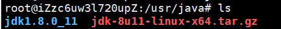
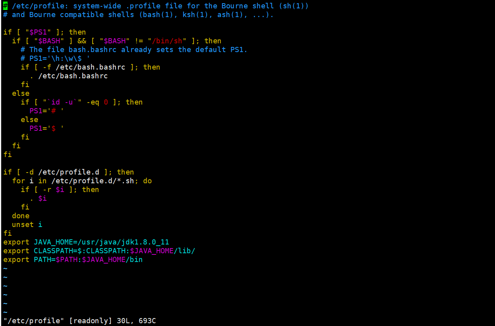
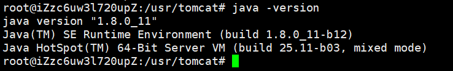
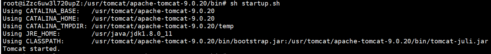
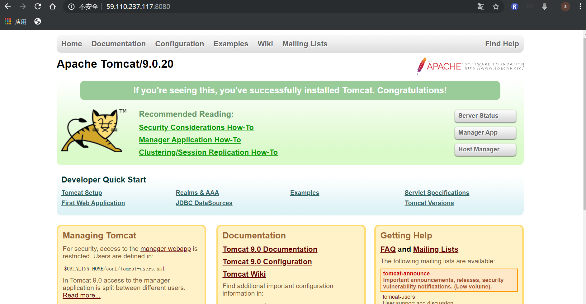
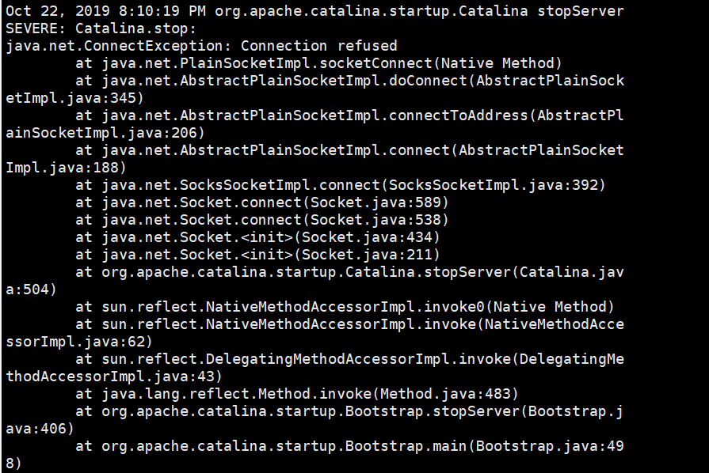
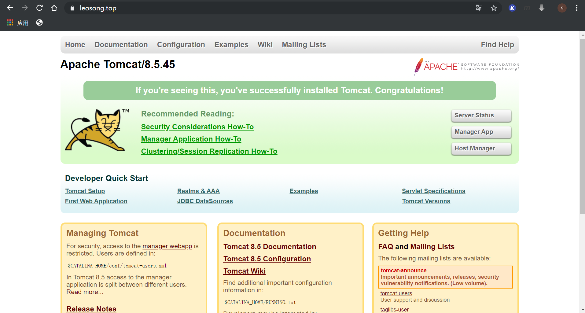
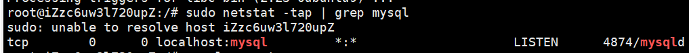
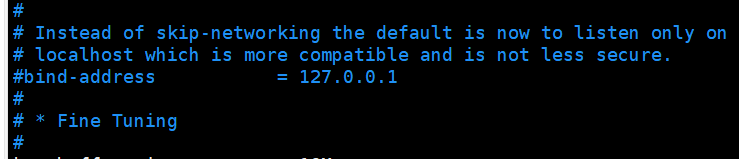
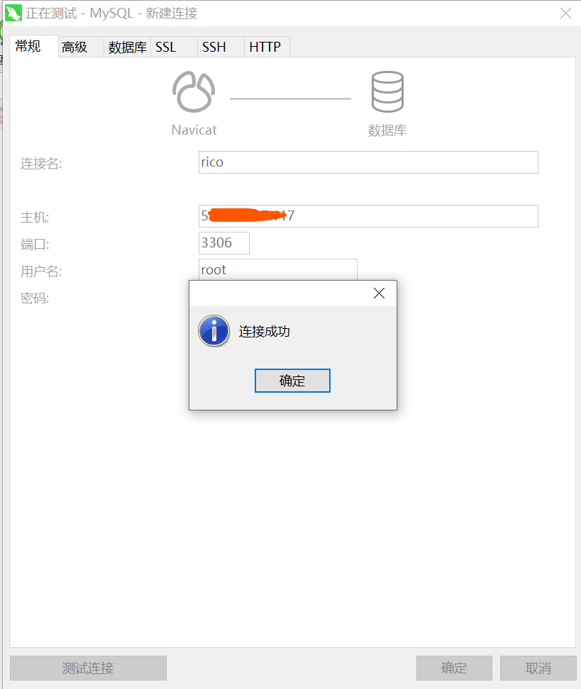

# 搭建个人博客

## 所需工具及软件

​		1.阿里云ESC 服务器 ubuntu 14
​		2.java 1.8 
​		3.mysql 5.1.7
​		4.tomcat 8.5
​		5.xshell/xftp

## 环境搭建

​	**一、安装JDK**
​	将jdk的压缩包通过 rz 命令上传到 /usr/java(需要自己新建 Java 文件)

**解压jdk到Java目录**

```
tar zxvf jdk-8u11-linux-x64.tar.gz
```



**配置环境变量,需输入以下指令**

```
vim /etc/profile
```

**然后在文件的末尾添加**

```javascript
export JAVA_HOME=/usr/java/jdk1.8.0_11
export CLASSPATH=$:CLASSPATH:$JAVA_HOME/lib/ 
export PATH=$PATH:$JAVA_HOME/bin                              
```



**使用 wq 保存并退出**

**使用以下命令刷新刚才配置的环境变量**

```javascript
source /etc/profile
```

**查看Java是否安装成功 ，执行命令：java -version**



**OK java 安装完成**

------

**二、安装Tomcat**

​		获取Tomcat 9 的安装包 上传到服务器 /usr/tomcat 目录下

**解压**
		执行以下命令,因为是 .zip文件 需先安装 unzip进行解压

```javascript
apt install unzip

unzip apache-tomcat-9.0.20.zip
```

**启动Tomcat**
		需要 cd  进入/tomcat/apache-tomcat-9.0.20/bin目录下 执行

```
sh startup.sh 或者 ./startup.sh
```

**如果报错**
		**-bash: ./startup.sh: Permission denied**是用户权限不够，需要执行

```
chmod u+x *.sh
```

**再次启动**



Tomcat 启动成功
在浏览器输入 服务器域名+端口号访问



Tomcat服务器搭建成功

**Tomcat 关闭时报错**



**解决办法**

​		进入Jdk 的安装目录   /usr/local/java/jdk1.8.0_11/(使用 **which java**查看),在进入/jre/lib/security/，使用vim 修改java.security文件

```
"securerandom.source=file:/dev/random" //修改该文件
```

```
"securerandom.source=file:/dev/urandom" 

```

**Ubuntu 系统 Tomcat8.5 部署SSL证书**

**前提条件**
			1.已从阿里云SSL证书服务控制台下载Tomcat服务器证书（包含PFX格式证书文件  和TXT格式密码文件）
			2.你申请的SSL证书时绑定的域名已完成DNS解析、实现了该域名指向你Tomcat服务器的IP地址。

**操作步骤**
			1.解压Tomcat证书
			2.在Tomcat的安装根目录下新建cert文件，把解压后的文件上传到cert目录下
			3.vim打开tomcat/conf/server.xml文件

```xml
//修改以下文件
<Connector port="8080" protocol="HTTP/1.1"  //将8080改成80
               connectionTimeout="20000"
               redirectPort="8443" />  //将8443改成443
//添加
<Connector port="443"  
   protocol="org.apache.coyote.http11.Http11NioProtocol"   
   maxThreads="150"
   SSLEnabled="true">
 <SSLHostConfig>
     <Certificate       				certificateKeystoreFile="/usr/local/tomcat/cert/证书名称.pfx"
         certificateKeystorePassword="密码"
         certificateKeystoreType="PKCS12" /> 
     </SSLHostConfig>
</Connector>

```

​		4.在web.xml文件中添加以下文件（让http访问跳转到https）

```xml
//在 </welcome-file-list>下添加
 <security-constraint> 
         <web-resource-collection > 
              <web-resource-name >SSL</web-resource-name>  
              <url-pattern>/*</url-pattern> 
       </web-resource-collection> 
       <user-data-constraint> 
                    <transport-guarantee>CONFIDENTIAL</transport-guarantee> 
       </user-data-constraint> 
    </security-constraint>

```

​		5.在阿里云服务器 开启443端口（不然很打老壳）
​		在tomcat 的安装目录的/bin目录下重启 tomcat服务

在浏览器输入 https://域名
	

------

**三、安装Mysql(ubuntu)**

**Linux执行命令**
```$xslt
wget https://dev.mysql.com/get/Downloads/MySQL-5.7/mysql-5.7.26-linux-glibc2.12-x86_64.tar.gz
```
**二、一键式傻瓜安装**

**在Linux 中按顺序执行以下命令**

```
sudo apt-get install mysql-server  //执行中会设置登录密码
//如果执行报错，数据源没有更新 执行
sudo apt-get update
sudo apt install mysql-client  
sudo apt install libmysqlclient-dev

```

**执行完后可以通过以下命令测试是否安装成功**

```
sudo netstat -tap | grep mysql

```

**安装成功图示**



 **通过Navicat进行远程连接mysql**

​		如果是云服务器需先在 服务器端放行3306端口 （重要）

​		执行以下命令，进入mysql

```mysql
mysql -uroot -p密码
//在执行
GRANT ALL PRIVILEGES ON *.* TO 'root'@'%' IDENTIFIED BY 'songrui' WITH GRANT OPTION;
//立即生效
flush privileges

```

​		退出MySQL 执行命令 

```
sudo vim /etc/mysql/mysql.conf.d/mysqld.cnf
//将bind-address = 127.0.0.1注释 让所有ip都可以访问

```



​		重启mysql服务

```
service mysql restart

```

​		测试连接
​		

